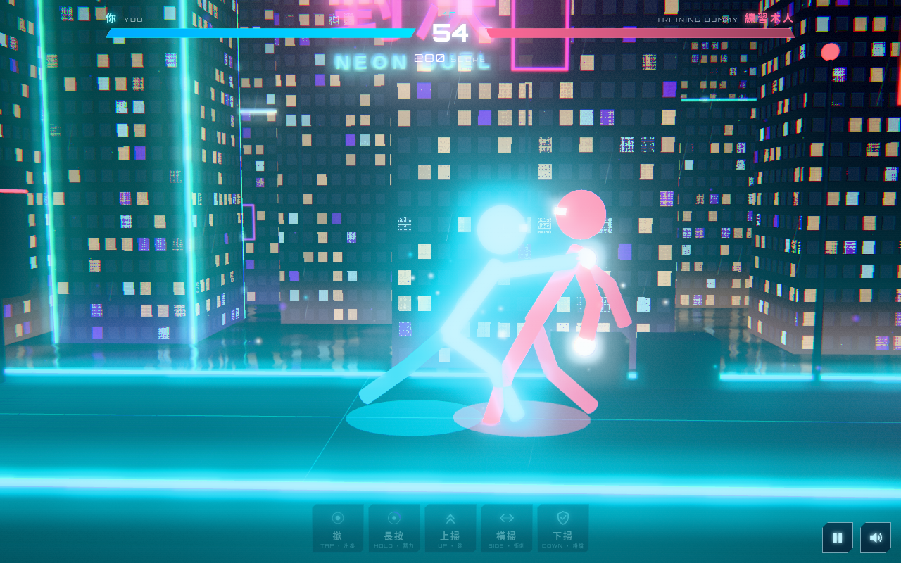

# 霓虹火柴人對決 NEON STICK DUEL

> 單指 3D 火柴人格鬥 · one-thumb 3D stick-figure duel · 八層天台塔 8-floor rooftop tower · Three.js · 手機優先

**試玩 Play:** https://fung2222.github.io/neon-stick-duel/ · **自動示範 Demo:** https://fung2222.github.io/neon-stick-duel/?demo=1



## 玩法 How to play
一隻手指就打得：角色會自動走位埋身，你只需要揀時機。
| 手勢 | 動作 |
|---|---|
| **撳** TAP | 出拳；連撳三下 = 拳、拳、飛腳三連擊 |
| **長按** HOLD | 蓄力，放手打出重擊；**儲滿**（光圈變白）= 破防，格擋都擋唔住 |
| **上掃** SWIPE UP | 跳躍（避開地面攻擊）；半空再撳 = 飛踢 |
| **橫掃** SWIPE SIDE | 衝刺（向前／向後），開頭有短暫無敵 |
| **下掃** SWIPE DOWN | 格擋：時機啱就彈開對手，佢會暈一陣 |

頭八層每層一個原創對手：練習木人 → 後巷打仔 → 霓虹刺客 → 重錘工人 → 雷光拳 → 鏡像分身 → 鐵壁守衛 → 塔主・零。之後係**無盡模式**：程式生成嘅變種對手（暗影／超載／鉻鋼…），難度慢慢上升但有上限，每 10 層一個里程碑（+5000 分、換區域顏色），記錄最高樓層。進度自動儲存，可以喺主畫面「繼續」。被 K.O. 可以睇廣告**原地復活**一次（網頁版免費）。

## 語言 Language
遊戲支援**繁體中文（香港）**同 **English**，喺主畫面或暫停畫面撳「EN／中」切換，會記住你嘅選擇（`localStorage cyber.lang`，所有 CYBER 遊戲共用）。網址加 `?lang=en` / `?lang=zh` 亦可。

## English
**NEON STICK DUEL** is a one-thumb 3D cyberpunk stick-figure fighter. Fighters close the distance automatically — you only pick the timing: **tap** to punch (×3 = combo), **hold** to charge a heavy (full charge breaks guards), **swipe up** to jump (tap in the air = dive kick), **swipe sideways** to dash (brief invulnerability), **swipe down** to parry. Climb an **endless rooftop tower**: 8 hand-made opponents, then procedurally remixed rivals with a capped difficulty curve, milestone bonuses every 10 floors and a saved best floor. Bilingual (Traditional Chinese / English) with an in-game toggle.

## 鍵盤 Keyboard
`J` / `Space` 出拳 · 按住 `K` 蓄力 · `↑` 跳 · `←` `→` 衝刺 · `↓` 格擋 · `P` / `Esc` 暫停 · `M` 靜音

## 網址參數 URL flags
`?demo=1` AI 對打示範 · `?fps=1` · `?quality=low` · `?adsim=1` · `?reset=1` · `?mute=1`

## 技術 Tech
Three.js r169 + [cyber-kit](https://github.com/fung2222/cyber-kit) v0.1.0（`vendor/cyber-kit/`），冇 build step。火柴人用 2D 正向運動學 + 姿勢混合即時生成；所有角色、圖示、音效都係原創／程式生成，冇使用任何商標名稱或遊戲機按鍵符號。

## 開發 Development
```bash
cd .. && python3 -m http.server 18940     # http://127.0.0.1:18940/neon-stick-duel/
node neon-stick-duel/tests/duel.test.mjs
python neon-stick-duel/tests/smoke.py
```
文件：[docs/HANDOFF.md](docs/HANDOFF.md) · [privacy.html](privacy.html) · 屬於 [CYBER ARCADE](https://github.com/fung2222/cyber-arcade) 系列。
